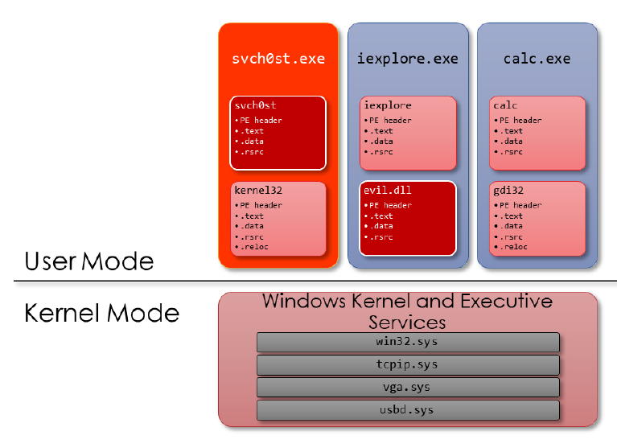

PE File Format – Overview

```
PE 
Portable Executable (PE) is the standard binary file format for Windows binaries. Extension of the Common Object File Format (COFF) originally used by UNIX System V in the
1980s


EXE
An executable program that, when executed, becomes an individual process with its own virtual address space


.DLL
Dynamic Link Library; Also referred to as a module
DLLs are mapped into the virtual address space of a process; Can be loaded and unloaded
DLLs offer malware authors greater flexibility in deploying their malware


```


```
PE File Format – Headers and Sections
It has a structured organization of Headers and Sections
• Headers tells OS how to interprete the PE file.
-  EXE , DLL OR SYS.
- Where is it's entry point         ( Entry point )
- How the section should be arranged in memory. ( Section Header )
- Which DLL dependecies are needed?  ( Imports )
- What functionality does PE expose to other apps.  ( Exports )

Section stores:
- executable code
- Program data
- Resources

```