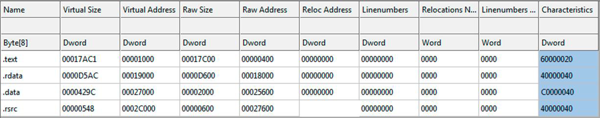
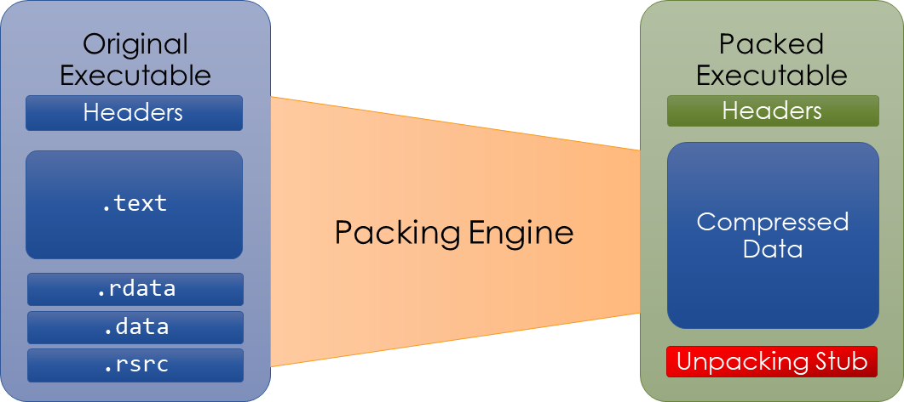

PE File Format – Overview

```
PE 
Portable Executable (PE) is the standard binary file format for Windows binaries. Extension of the Common Object File Format (COFF) originally used by UNIX System V in the
1980s


EXE
An executable program that, when executed, becomes an individual process with its own virtual address space


.DLL
Dynamic Link Library; Also referred to as a module
DLLs are mapped into the virtual address space of a process; Can be loaded and unloaded
DLLs offer malware authors greater flexibility in deploying their malware


```


```
PE File Format – Headers and Sections
It has a structured organization of Headers and Sections
• Headers tells OS how to interprete the PE file.
-  EXE , DLL OR SYS.
- Where is it's entry point         ( Entry point )
- How the section should be arranged in memory. ( Section Header )
- Which DLL dependecies are needed?  ( Imports )
- What functionality does PE expose to other apps.  ( Exports )

Section stores:
- executable code
- Program data
- Resources


PE FILE format -DOS Header 

o Contains “MZ” file signature
o Stores the offset to the PE header
o 16-bit DOS stub program

Rich header => compiler generated
optional / metadata
used by malware auth for -> config data  storage.


Section Header 
Each pe sectoin has it's own section header entry.

Section names are arbitrary but typically follow a common naming convention 
(e.g., “.text”, “.data”, “.rdata”)


- Raw Size value indicates the size of the section as stored on disk
- Virtual Size value indicates the size of the section in memory
- Raw Address is the section offset relative to the beginning of the file
- Virtual Address is the section offset relative to the beginning of the file stored in memory
- Characteristics indicate if the section is readable, writable, or contains executable code


.text  -> executable code of program
.rdata -> read-only data accecible by program. Used to sotre imp/exp addr table.
.data -> contain initialized data that can be changed by program by execution.
.rsrc -> secion used to store support files used by program.
.reloc -> contain table address fixup allowing PE file to be relocated to another base address by Win loader.


PE File Format – Import Address Table
Import Address Table (IAT) contains the names of external modules (DLLs) required by the program in
order to execute
Functionality provided by common Windows DLLs

kernel32 ->  MainWin32 API lib ->contain function for file sys operation / sys config / progcess / thread / mem mgmt
advapi32 -> registry interaction / win service / security & crypto API
user32 -> UI / keyboard function / window draw & interaction
w2_32 -> low level networking function ( sockets ).
wininet -> high level networking function ( http , ftp ) 


PE File Format – Import Table

The Windows loader locates libraries listed in the Import Table and maps them into process memory
Grouped by modules
Functionality may be inferred by examining a sample’s imports:
o CreateProcessA
o RegSetValueA
o URLDownloadToFileA

Many Windows functions have peculiar names
o MSDN Library
o Appendix A of Practical Malware Analysis
Can be imported by name or ordinal
```



```
PE File Format – Export Table

Export Table contains a list of functions that other applications can import
o For example, the CreateFileA function is exported by kernel32.dll


Linking
Library code can be linked statically or dynamically

Static Linking
o The linker creates a copy of all supporting code and inserts it directly into the compiled executable
o Creates very large executables that are difficult to analyze without symbol information (e.g., OpenSSL ) 

Load-time Dynamic Linking
o The program imports functions from DLLs via its import table
o The program cannot run if DLL dependencies are missing

Run-time Dynamic Linking
o The program loads an external library and resolves the functions it requires
▪ Look for calls to LoadLibrary or GetModuleHandle and GetProcAddress
o Used regularly by malware to hinder static analysis and required for reliable shellcode payloads


Packing
• Packing involves compressing or obfuscating a PE and storing it inside an executable whose purpose is to
unpack and execute the original sample.

AV alerts on packed PE's
Deter static analysis and RE


Identifying packed Samples
few / none human readable strings
Only contain Handful of imort api 
Unusual section names
Sections with a Raw Size of zero

Tools to detect & identinfying packers

PEid
DIE
CFF exploler 


Unpacking 
Rebuilding the original PE from the packed version.

Tools for automatic unpacking
o CFF Explorer
o upx command line tool

Packed PE's must be manually unpacked & rebuilt.

UPX
• UPX is packing software commonly used by malware authors
▪ upx –d <input_filename> -o <output_filename>

CFF exploler can also support unpacking UPX samples
UPX Utility
If "Unpack" box is active, then CFF can unpack the sample

CAPA
• Uses a collection of rules to identify capabilities within a program
• Verbose mode reveals code locations for Advanced Static Analysis (-vv)

```



```

```